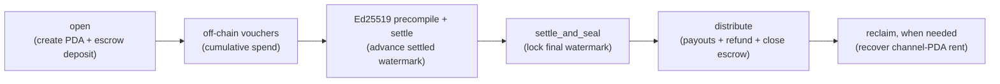
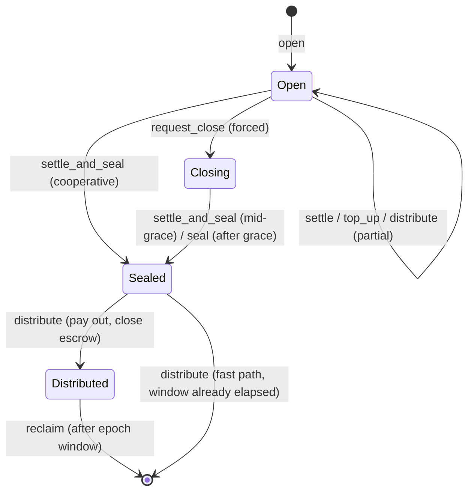

# payment-channels

> Payment channels make agentic payments practical by escrowing a spending ceiling on-chain and settling actual usage from signed vouchers; this program backs [MPP `session`](https://paymentauth.org/draft-solana-session-00.html) for streaming or repeated payments and [x402 `upto`](https://github.com/x402-foundation/x402/blob/main/specs/schemes/upto/scheme_upto_svm.md) for one metered request.

**Status — live on mainnet:** [`CHNLxYvVA28MJP9PrFuDXccuoGXAx7jBacfLEkahyGsX`](https://explorer.solana.com/address/CHNLxYvVA28MJP9PrFuDXccuoGXAx7jBacfLEkahyGsX)

## Why

One on-chain `open` and one `settle` replace a transaction per payment. The payer escrows a ceiling; the merchant claims only what off-chain vouchers authorize; the payer recovers the rest. That makes **metered, streamed, or many-small** payments viable where settling every request on-chain is too slow and too expensive.

## Lifecycle





Vouchers are signed off-chain (Ed25519) and carry a **cumulative** amount, so a newer voucher supersedes older ones and the program never settles more than the deposit. `distribute` pays the settled amount; once the channel is sealed, `distribute` or `withdraw_payer` can refund the unspent remainder immediately—no token movement waits on the epoch window. The channel account itself is then fully deallocated (directly, or by a later `reclaim` once the window elapses), returning 100% of its rent: a closed channel leaves nothing on chain.

## Architecture

- The [Pinocchio](https://github.com/anza-xyz/pinocchio) program stores each channel in a 256-byte PDA derived from `b"channel"`, `payer`, `payee`, `mint`, `authorized_signer`, `salt`, and `open_slot`. Its escrow is the canonical ATA owned by that PDA.
- `open_slot` makes every channel incarnation land at a new address. `open` accepts only a current-or-recent slot (`OPEN_SLOT_WINDOW = 1,500`), and the program keeps the PDA allocated until that window has elapsed. An old voucher therefore cannot target a later incarnation.
- Channel fields—not raw token or lamport balances—are authoritative. Third-party token prefunds are uncredited and swept to treasury by the terminal `distribute`; surplus PDA lamports return to `rent_payer` when the account is deallocated.
- `open` stores only the SHA-256 commitment to the canonical distribution preimage. Any permissionless `distribute` caller supplies the preimage and recipient ATAs.
- `rent_payer` can differ from the token payer, allowing an operator to fund SOL rent for a stablecoin-only client and recover that SOL at close.

## Voucher wire format

The Ed25519-signed message is exactly 50 bytes:

| Offset | Size | Field | Encoding |
| --- | ---: | --- | --- |
| `0..2` | 2 | `magic` | `[0x56, 0x01]` (`'V'`, format version 1) |
| `2..34` | 32 | `channel_id` | Channel PDA bytes |
| `34..42` | 8 | `cumulative_amount` | `u64`, little-endian |
| `42..50` | 8 | `expires_at` | Unix timestamp as `i64`, little-endian; `0` disables expiry |

`settle` carries no voucher copy in its own instruction data. The transaction places a canonical single-signature Ed25519 precompile instruction immediately before `settle` (or before voucher-bearing `settle_and_seal`); the program reads the verified 50-byte message through the Instructions sysvar. See the [state-machine voucher contract](docs/001-payment-channel-state-machine.md#voucher) for replay, expiry, and signer checks.

## Used by pay.sh

This program is the on-chain settlement layer behind two [pay.sh](https://pay.sh) payment primitives. Both deposit a ceiling here, meter off-chain, and settle the actual amount on this program:

- **x402 `upto`** — a single metered call: the operator settles one voucher for the actual amount and refunds the rest.
- **MPP `session`** — a streamed channel: many cumulative vouchers, settled once when the session idle-closes.

See **[Payment channels](https://pay.sh/docs/building-with-pay/payment-channels/concept)** on pay.sh for the protocol handshakes and when to pick each.

## Instructions

| Instruction | Role |
| --- | --- |
| `open` | Create the channel PDA and escrow the deposit. |
| `settle` | Advance the on-chain settled amount from the preceding Ed25519-verified voucher. |
| `settle_and_seal` | Settle a final voucher and seal in one step (cooperative). |
| `top_up` | Add funds to an open channel. |
| `request_close` | Payer-initiated forced close — starts the grace period. |
| `seal` | Seal a forced-closing channel once the grace period elapses. |
| `distribute` | Pay cumulative recipient/payee shares while open; when sealed, refund the payer, sweep residuals, and close the escrow. |
| `withdraw_payer` | Payer recovers the unspent remainder. |
| `reclaim` | Deallocate a distributed channel and recover its rent (batchable). |

## Build & test

```sh
just setup
just build-program
just generate-client
just test-program
```

Cluster builds (`just build-mainnet-beta`, `just build-devnet`, …) require that cluster's real `TREASURY_OWNER` in `program/payment_channels/src/constants.rs` and refuse to compile with the placeholder. No production keypair is committed — pass the program-id keypair explicitly when deploying.

## Docs & clients

- [State machine](docs/001-payment-channel-state-machine.md)
- [HTTP protocol](docs/002-http-protocol.md)
- [Instruction reference](docs/003-program-instructions.md)
- Generated clients: [TypeScript](clients/typescript), [Rust](clients/rust).

## License

MIT. See [LICENSE](LICENSE).

## Future work: payment channel v2

"v2" is a set of proposed, unimplemented ADRs that keep the version-1 voucher format and the escrow model but cut the per-session and per-channel settlement cost. None is enabled in production; all are planning envelopes, not benchmarks.

- **[ADR-004](docs/004-batch-voucher-settlement.md) — batch voucher settlement.** A `settleBatch` instruction lets one Ed25519 voucher authorize cumulative targets for many channels that share an `authorized_signer`, committing to the ordered channel list and one amount per channel. A version-0 transaction with an address lookup table then settles roughly 59 channels instead of about five, preserving per-channel caps and replay checks. Requires a new voucher wire format.
- **[ADR-005](docs/005-channel-rearm.md) — channel re-arm.** A `rearm` instruction ends one session and starts the next on the *same* accounts — enforce the final voucher, pay pending deltas, refund the payer's unspent deposit, leave the channel `OPEN` — so a persistent channel amortizes its one-time open/close over K sessions (~2.1× cheaper per boundary) with no `Channel` layout change and no new wire format. This is the core of v2.
- **[ADR-006](docs/006-settlement-rollup.md) — settlement rollup.** A candidate only: one ~300k-CU Groth16 proof, built on the alt-bn128 pairing syscalls already live on mainnet, attests N cross-payer vouchers at once so settlement *verification* becomes independent of N. Warranted only for mutually-distrusting payers whose channels cannot share an `authorized_signer` — otherwise ADR-004 + the MPP operator-signed mode already settle more cheaply.

## Security audit

The program was audited by [Cantina](https://cantina.xyz). Read the [July 2026 security audit](audits/report-cli-cantina-7e1ee899-54e4-4841-8c70-c73e667a0a39-2026-07-27-solana-foundation-payment-channels-9c97d575.pdf).
